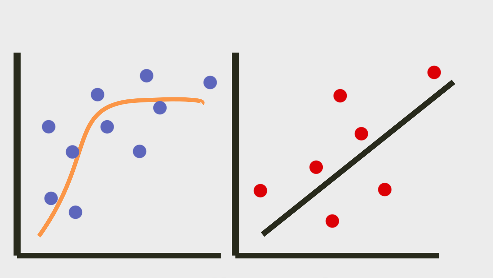

  
```{r, include = FALSE}
knitr::opts_chunk$set(
  collapse = TRUE,
  comment = "#>",
  out.width = "100%"
)
options(tibble.print_min = 5, tibble.print_max = 5)
```

# flexplot </a>

<!-- badges: start -->
<!-- [](https://cran.r-project.org/package=dplyr) -->
[](https://travis-ci.org/dustinfife/flexplot)
[](https://codecov.io/gh/dustinfife/flexplot?branch=master)
<!-- badges: end -->
  
## Overview
  
flexplot is a set of tools designed to pair with statistical modeling and simplify the process of visualizing data analysis. Some of the primary functions include:
  
* `flexplot()` flexible and intelligent multivariate graphics
* `added.plot()` added variable plots
* `visualize()` shows a visual representation of a fitted object
* `compare.fits()` visually compares the fit of two different models
* `estimates()` reports of effect sizes for statistical models
* `model.comparison()` statistically compares the fits of two different models

A more complete manual for flexplot can be found at the [Psych Arxiv](https://psyarxiv.com/kh9c3)


## Installation of flexplot

```{r, eval = FALSE}
# install.packages("devtools")
# install the stable version
devtools::install_github("dustinfife/flexplot")
# install the development version
devtools::install_github("dustinfife/flexplot", repo="development")
```


## Usage
  
```{r, message = FALSE, warning=FALSE, message=FALSE}
library(flexplot)
data(relationship_satisfaction)

### multivariate relationship
flexplot(satisfaction~communication + separated | gender + interests, data=relationship_satisfaction)

### show a straight line, remove standard errors, and specify 3 bins
flexplot(satisfaction~communication + separated | gender + interests, data=relationship_satisfaction, method="lm", se=F, bins=3)

### show a ghost line to simplify comparisons
flexplot(satisfaction~communication + separated | gender + interests, data=relationship_satisfaction, method="lm", se=F, bins=3, ghost.line="black")

### categorical variable
flexplot(satisfaction~gender, data=relationship_satisfaction, spread="quartiles", jitter=c(.1, 0))

### histogram/barchart
flexplot(satisfaction~1, data=relationship_satisfaction)
flexplot(gender~1, data=relationship_satisfaction)

### added variable plot
added.plot(satisfaction~communication + separated | gender + interests, data=relationship_satisfaction, method="polynomial", se=F)

### modeling + graphics
full.mod = lm(satisfaction~communication * separated , data=relationship_satisfaction)
reduced.mod = lm(satisfaction~communication + separated , data=relationship_satisfaction)
visualize(full.mod)
estimates(full.mod)
compare.fits(satisfaction~communication|separated, data=relationship_satisfaction, full.mod, reduced.mod)
model.comparison(full.mod, reduced.mod)

```

## Getting help

If something breaks, please post a minimal reproducible example on [github](https://github.com/dustinfife/flexplot/issues). For questions and other discussion, contact me on [twitter](http://www.twitter.com/dustinfife) or by [email](fife.dustin@gmail.com).

