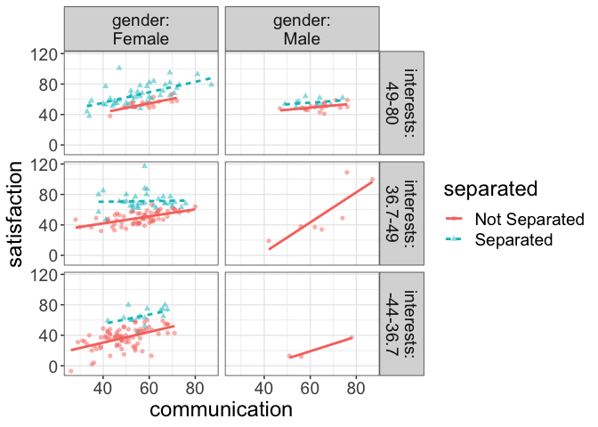
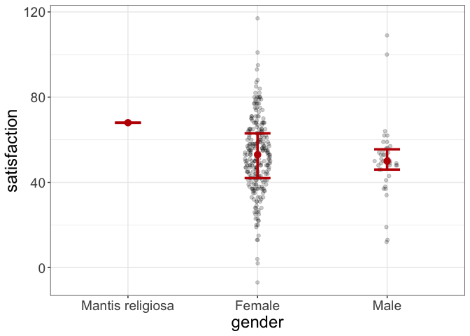
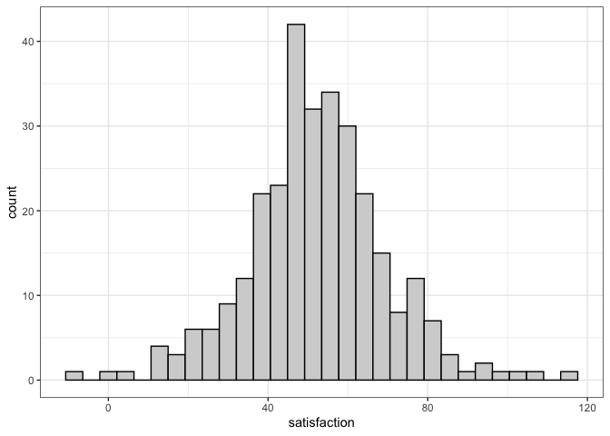
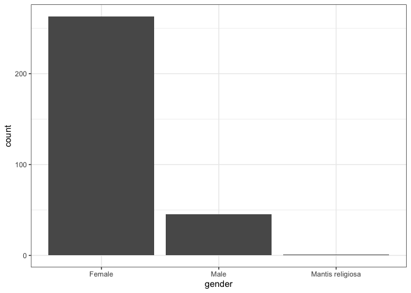
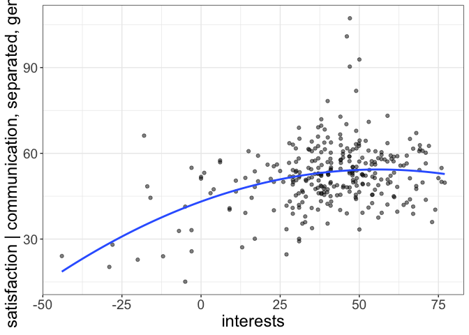
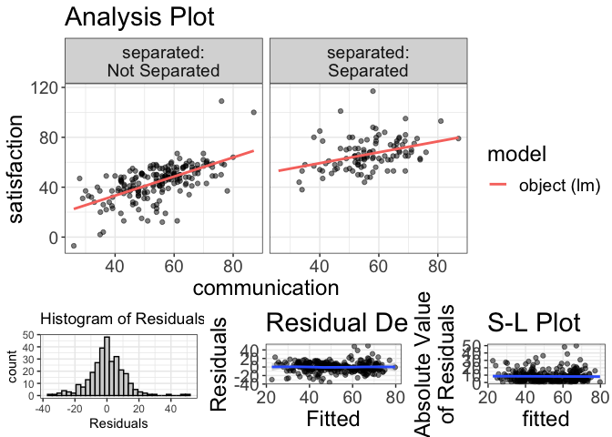
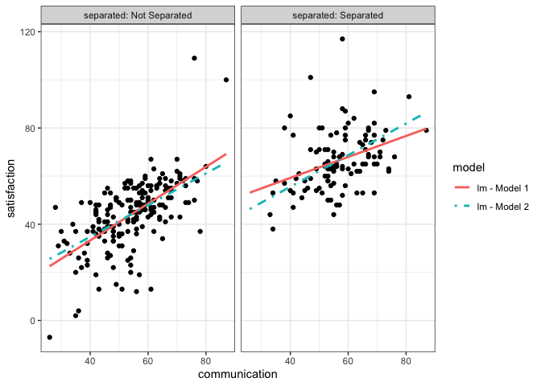

# flexplot </a>

<!-- badges: start -->

<!-- [](https://cran.r-project.org/package=dplyr) -->

[](https://travis-ci.org/dustinfife/flexplot)
[](https://codecov.io/gh/dustinfife/flexplot)
<!-- badges: end -->

## Overview

flexplot is a set of tools designed to pair with statistical modeling
and simplify the process of visualizing data analysis. Some of the
primary functions include:

  - `flexplot()` flexible and intelligent multivariate graphics
  - `added.plot()` added variable plots
  - `visualize()` shows a visual representation of a fitted object
  - `compare.fits()` visually compares the fit of two different models
  - `estimates()` reports of effect sizes for statistical models
  - `model.comparison()` statistically compares the fits of two
    different models

A more complete manual for flexplot can be found at the [Psych
Arxiv](https://psyarxiv.com/kh9c3)

## Installation of flexplot

``` r
# install.packages("devtools")
# install the stable version
devtools::install_github("dustinfife/flexplot")
# install the development version
devtools::install_github("dustinfife/flexplot", repo="development")
```

## Usage

``` r
library(flexplot)
data(relationship_satisfaction)

### multivariate relationship
flexplot(satisfaction~communication + separated | gender + interests, data=relationship_satisfaction)
```


``` r

### show a straight line, remove standard errors, and specify 3 bins
flexplot(satisfaction~communication + separated | gender + interests, data=relationship_satisfaction, method="lm", se=F, bins=3)
```



``` r

### show a ghost line to simplify comparisons
flexplot(satisfaction~communication + separated | gender + interests, data=relationship_satisfaction, method="lm", se=F, bins=3, ghost.line="black")
```


``` r

### categorical variable
flexplot(satisfaction~gender, data=relationship_satisfaction, spread="quartiles", jitter=c(.1, 0))
```



``` r

### histogram/barchart
flexplot(satisfaction~1, data=relationship_satisfaction)
```



``` r
flexplot(gender~1, data=relationship_satisfaction)
```



``` r

### added variable plot
added.plot(satisfaction~communication + separated | gender + interests, data=relationship_satisfaction, method="polynomial", se=F)
```



``` r

### modeling + graphics
full.mod = lm(satisfaction~communication * separated , data=relationship_satisfaction)
reduced.mod = lm(satisfaction~communication + separated , data=relationship_satisfaction)
visualize(full.mod)
```



``` r
estimates(full.mod)
#> Model R squared:
#> 0.567 (0.49, 0.64)
#> 
#> Semi-Partial R squared:
#> communication:separated 
#>                    0.01 
#> 
#> Estimates for Factors:
#>   variables        levels estimate lower upper
#> 1 separated Not Separated    44.72  43.1 46.35
#> 2               Separated    65.78 63.56    68
#> 
#> 
#> Mean Differences:
#>   variables              comparison difference lower upper cohens.d
#> 1 separated Separated-Not Separated      21.06  17.2 24.91     1.84
#> 
#> 
#> Estimates for Numeric Variables = 
#>       variables estimate lower upper std.estimate std.lower std.upper
#> 1   (Intercept)     2.66 -5.28 10.59         0.00      0.00      0.00
#> 2 communication     0.76  0.62  0.91         0.49     -0.47      1.45
compare.fits(satisfaction~communication|separated, data=relationship_satisfaction, full.mod, reduced.mod)
```



``` r
model.comparison(full.mod, reduced.mod)
#> $statistics
#>                  aic      bic bayes.factor p.value r.squared
#> full.mod    2312.712 2331.214        1.566  0.0108     0.567
#> reduced.mod 2317.309 2332.111        0.639             0.557
#> 
#> $pred.difference
#>    0%   25%   50%   75%  100% 
#> 0.003 0.040 0.084 0.158 0.585
```

## Getting help

If something breaks, please post a minimal reproducible example on
[github](https://github.com/dustinfife/flexplot/issues). For questions
and other discussion, contact me on
[twitter](http://www.twitter.com/dustinfife) or by
[email](fife.dustin@gmail.com).
