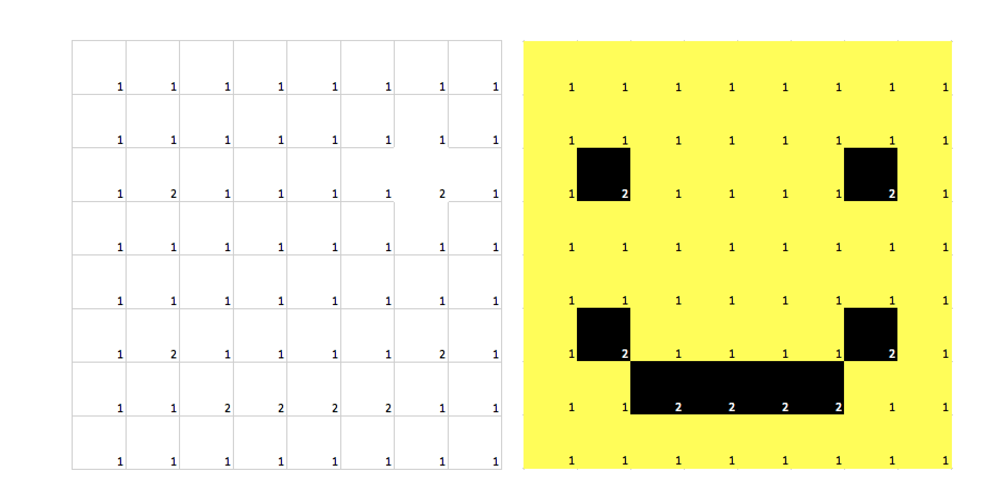

# Introduction {-}

In light of the recent "replication crisis" [@Pashler2012a; @OpenScienceCollaboration2015], researchers are becoming increasingly concerned with the validity of science [@Baker2016a]. As such, many are pushing for greater transparency and reproducibility [@Nelson2018; @Nosek2018]. One way to accomplish greater transparency is through abudant use of data visualizations [@Tay2016], particularly when data are presented in their raw form. 

In addition to answering the call for greater transparency, graphics offer several additional advantages. First, they improve communication between the scientific community and the public. Lay people can understand relatively sophisticated statistical procedures when that information is presented graphically [@Correll2015a]. Additionally, graphics highlight problems with models that are masked by traditional statistical procedures, such as nonlinearity, outliers, heteroscedasticity, etc. As such, graphics serve as an important diagnostic check. Finally, graphics improve encoding. Consider the image displayed in Figure \@ref(fig:smiley), taken from Correll (2015). The table on the left presents the same information as the one on the right, though the encoding of the information on the right is much easier because that information is conveyed *visually.*


```{r, smiley, fig.cap = "A table of numbers on the left, and a color-coded table on the right, where the 2's have been highlighted in yellow. With the color, a pattern emerges that was not easy to see without the graphic. Figure used with permission from @Correll2015a", message=FALSE, warning=FALSE,width=4, fig.align='center', echo=FALSE}
require(ggplot2)
require(flexplot)
data(exercise_data)

```

While visualizations have many advantages, they can also be used to mislead, sometimes intentionally, and sometimes not intentionally. For example, when means/standard errors are presented as barcharts, people tend to judge values below the mean (i.e., within the confines of the bar) as far more likely than values above the mean, even when the underlying distribution is symmetric [@Correll2015a]. Unfortunately, aesthetics are often conflated with informativeness, and people often convince themselves they are learning something important from poor graphics [@Padilla2015]. To further complicate matters, the default images in most point-and-click statistical software violate important visualization heuristics [@Fife2019]. For example, in SPSS it is impossible (as far as I know) to produce standard error plots that display raw data (jittered or otherwise). Also, with standard error plots, the axes are scaled to the means, not the range of the actual data, which visually inflates the size of the effect. In addition, producing some types of graphics (e.g., Skew-Location plots) require more effort than many are willing to perform (the user must model the data, export the residuals, jitter the residuals, then produce a scatterplot).

Flexplot was designed to address these limitations. Flexplot was developed using empirically-derived heurstics that maximize perceptual understanding, while minimizing perceptual biases. Also, the graphics produced are simple to generate and permit analysts to quickly shift between statistical modeling and graphical interpretation. 

# Guiding Philosophy of Flexplot {-}
The design of Flexplot is based on the following principles: 

*1. Minimize obstacles to producing graphics.* The easier it is to produce graphics, the more likely graphics will be used, and the more resources the researcher will have available to interpret the data. Technology companies like Apple and Google spend millions of dollars attempting to make the interaction between humans and technology as seamless as possible. One-click purchasing, voice-activated personal assistants like Siri, movies-on-demand, and audible app notifications are all tricks companies use to remove obstacles to using their technology. Likewise, if producing a graphic is as simple (or simpler) than performing a statistical analysis, they too will become heavily utilized (and, dare I say, addictive?). Furthermore, the less effort required to produce graphics, the more resources available to invest in *interpreting* graphics. To make producing graphics as simple as possible, Flexplot makes many of the plotting decisions in the background, such as choosing between types of graphics (e.g., histograms versus bar charts) and how those graphics are displayed.

*2. Design graphics that leverage human strenths and mitigate human biases.* Successful technology capitalizes on human strengths. A mobile phone, for example, leverages humanity's advanced finger tactile sensitivity and dexterity. A phone designed to be used by one's foot would be a very poor choice indeed. Likewise, a computer that sends olefactory information might work well for a dog, but not a human. Graphics technology ought to be designed with the same principles in mind. Unfortunately, standard statistical analyses do not capitalize on human strengths. It takes a great deal of training to understand even basic statistics, and even then results are frequently misinterpreted. To overcome this limitation, some of the tools within Flexplot create visual representation of the statistical models. These representations highlight uncertainty, reveal whether chosen models are appropriate, and improve encoding of statistical information. 


# A New Grammar of Graphics {-}
Hadley Wickham, the author of `ggplot2`, developed a "layered" grammar of graphics [@Wickham2010]. Wickham's grammar allows a great deal flexibility in the design of graphics. However, this flexibility comes at cost. Very often the grammar necessary to produce a graphic requires a great deal of coding to produce. For example, consider the code to create jittered mean plots:


```{r, b, message=FALSE, echo=TRUE, warning=FALSE}


plot = ggplot(data=exercise_data, aes(x=therapy.type, y=weight.loss)) +
  geom_jitter(amount=.2, alpha=.4) +
  stat_summary(fun.y='mean', geom='point', 
               size=3, position=position_dodge(width=.2)) +
  stat_summary(geom='errorbar', fun.ymin = function(z){mean(z)-1.96*sd(z)}, 
               fun.ymax=function(z) {mean(z)+1.96*sd(z)}, 
               size=1.25, width=.2, position=position_dodge(width=.2)) 
```
As noted earlier, the more difficult it is to produce a graphic, the more likely it is someone will simply not use it. A similar graphic can be produced with only one line of code using the `flexplot()` function:

```{r, c, message=FALSE, echo=TRUE, warning=FALSE}
plot = flexplot(weight.loss~therapy.type, data=exercise_data)
```


Naturally, this simplicity comes at a cost; Flexplot is more limited than ggplot2. However, Flexplot will cover the majority of graphics analysts will use for statistical modeling. However, in the end, graphics produced through Flexplot are still `ggplot2` objects. As such, they can be edited and/or layered for further customization. 


Flexplot's grammar is based on the general linear model (GLM). Recall that most statistical procedures are subsumed within the GLM, which is essentially regression. For example, a t-test is simply a regression where the intercept is the mean of the referent group (e.g., the control group) and the slope is simply the difference between the treatment and control groups. The base R function `lm` utilizes GLMs to do various sorts of modeling, and all this is accomplished using a simple equation (e.g., `y~x1 + x2`). Likewise, Flexplot adopts the same convention, utilizing a similar equation to produce graphics. Figure xxx shows an illustration that shows what components of a Flexplot equation produce what elements of a grahpic. The first variable in the equation ($X1$) specifies which variable is displayed on the $X$ axis. The second variable ($X2$) is displayed as different colors/symbols/lines. The third and fourth elements are shown as row and column panels, respectively. By following the grammar of a GLM, there is  perfect alignment between statistical modeling and visualization, with a few notable exceptions. Most obviously, a GLM equation (e.g., `plot(y~x1 + x2 + x3, data=data)`) does not have any vertical pipes (`|`) as `flexplot()` does. This is necessary in `flexplot()` to allow more specificity in paneling. Additionally, with GLMs, one must explicitly specify interaction and polynomial terms. This isn't necessary with `flexplot()`; the raw data are displayed exactly as they are and if interactions are present, the visual will show it. 

The base `plot()` function in R follows similar conventions to Flexplot (i.e., users can specify an equation, such as `plot(y~x)`), though `flexplot()` is more intelligent in its choices of displays. Also, `plot()` only allows the user to visualize one variable at a time. Another function, `coplot()`, allows some multivariate visualizations, yet it is limited in the types of data allowed and, like `plot()` isn't flexible in the types of visualization decisions it makes. The Flexplot package, on the other hand, offers great flexibility and automates much of the decision-making. 

In the following section, I will demonstrate how decisions are made in Flexplot. I begin by showing how to produce univariate graphics, then bivariate graphics, then multivariate graphics. I will then follow that up with various functions and techniques for combining visuals with models, then conclude with a brief summary. 

# Univariate Graphics {-}

In `lm()`, one can model an "intercept only" model, using the code `lm(y~1)`. This is equivalent to estimating the mean of $y$. Flexplot follows a similar convention with visualizing univariate distributions. However, the type of graphic displayed depends on the type of variable inputted into the function. For example, in the code below, notice that `flexplot()` recognizes whether the variable is categorical or numeric, and plots accordingly. 

```{r, message=FALSE, echo=TRUE, warning=FALSE, fig.cap = "A histogram (left) and barchart (right) produced by `flexplot()`.", fig.width=6, fig.height=3, out.width="90%", fig.align='center'}
require(flexplot)
data(exercise_data)
a = flexplot(weight.loss~1, data=exercise_data)
b = flexplot(gender~1, data=exercise_data)
cowplot::plot_grid(a,b)
```


Sometimes, `flexplot()` will make a wrong guess, if, for example, a categorical variable is recorded as a number (e.g., 1=Group 1, 2= Group 2, 3 = Group 3). To force `flexplot()` to produce a barchart, simply convert the variable to a factor (e.g., `data$group = factor(data$group, levels=1:3, labels=c("Group1", "Group2", "Group3"))`). 

# Bivariate Graphics {-}

As with univariate graphics, Flexplot will automatically produce an appropriate graphic, depending on the type of predictors variable (PV) and outcome variable (OV): numeric PV/numeric OV will produce a scatterplot, numeric PV/categorical OV = logistic curve graph, categorical PV/numeric OV = jittered density plot, and categorical PV/categorical OV = bar chart. 

## Categorical Predictor, Numeric Outcome (Jittered-Density Plots) {-}

There are many different ways to visualize a categorical predictor/numeric outcome relationship, including bar plots of means, box plots, violin plots, gradient plots, etc. Some are misleading (e.g., barplots of means, standard error plots). Others are mediocre (e.g., boxplots). Finally, some perform exceptionally well in human testing, including violin plots and gradient plots [@Correll2015a]. `flexplot()` defaults to a "textured dot strip," which was invented by @Tukey1990 jittered-density" plot [see also @Wilkinson1999]. However, I'm not too fond on the name. It lacks pizzazz. I have taken the liberty of renaming them "jittered density plots." I leave it to the reader to decide if this is pazzazzy enough. These are essentially violin plots with raw data. I find it important to have raw data because without that, it's impossible to tell the difference between a dataset with 10,000 versus 10 observations. For example, the two distributions in the left image in Figure \@ref(fig:raw) look essentially the same, while the same data, plotted as JD plots, very clearly show the sample size. 

```{r, raw, message=FALSE, echo=TRUE, warning=FALSE, fig.cap = "Violin plots with 15,000 versus 15 datapoints. The outlines look the same in the left image, but the right image overlays the raw data, which makes the differing sample sizes much more apparent.", fig.width=6, fig.height=3, out.width="90%", fig.align='center'}
#### generate data for two groups with unequal sample sizes, 
#### but the same distribution

group1 = c(0,1,2,2,3,3,3,3,3,3,4,4,5,6)
group2 = rnorm(10000,3,1)

d = data.frame(score=c(group1, group2), 
               group=c(rep("group 1", times=length(group1)), 
                       rep("group 2", times=length(group2))))
a = ggplot2::ggplot(data=d, aes(x=group, y=score)) +  geom_violin() 

b = flexplot(score~group, data=d)
cowplot::plot_grid(a,b)

```


In `flexplot()`, one can control the amount of jittering. The amount of jittering can be specified in multiple ways: as a boolean (`TRUE` means it will jitter, `FALSE` it won't), as a number (e.g., `0.2`), or as a vector (e.g., `c(.2, .4)`, which will indicate .2 jittering for X and .4 for Y). Just as it is in `geom_jitter()`, this number refers to the amount of jittering on either side. However, the value refers to the *maximum* amount the computer will jitter the data. So, 0.2 (the default) will jitter 10% of the way to the right only at the highest density and 10% to the left at the highest density. 

Users can also specify what the "whiskers" mean for the summary statistics. They default to the interquartile range (with the median as the center dot), but the user can also specify `sterr`, or `stdev,` to indicate the standard error or standard deviation:


```{r, message=FALSE, echo=TRUE, warning=FALSE, fig.cap = "Dot plots with IQR and no jittering (left), JD plot with mean + standard errors + jittering on $X$ and $Y$ (middle), and JD plot with mean + standard deviation with jittering on only $X$ (right), as well as different forms of jittering.", fig.width=6, fig.height=2.5, out.width="90%", fig.align='center'}
data("exercise_data")
a = flexplot(weight.loss~therapy.type, data=exercise_data, 
             jitter=F, spread="quartile")
b = flexplot(weight.loss~therapy.type, data=exercise_data, 
             jitter=c(.4,.5), spread="sterr")
c = flexplot(weight.loss~therapy.type, data=exercise_data, 
             jitter=.2, spread="stdev")
cowplot::plot_grid(a,b,c, nrow=1)
```


## Numeric Predictor, Numeric Outcome (Scatterplots) {-}

The indisputed king of numeric on numeric visualization is the scatterplot. Once again, `flexplot()` is smart enough to know to plot a scatterplot when it is passed a numeric predictor. The fit of the graph defaults to a loess line, so as to highlight deviations from linearity. However, the user can specify other sorts of fits, such as `"lm"` (for regression), `"polynomial"`, `"cubic"`, and `"rlm"` (robust linear models). The user can also choose to remove the confidence interval by specifying `se=F`, as well as jitter one or both variables, as shown below. 

```{r, message=FALSE, echo=TRUE, warning=FALSE, fig.cap = "Scatterplot with different options of fit: loess (default), lm (regression), polynomial", fig.width=6, fig.height=2.5, out.width="90%", fig.align='center'}
data("exercise_data")
a = flexplot(weight.loss~satisfaction, data=exercise_data)
b = flexplot(weight.loss~satisfaction, data=exercise_data, 
             method="lm", se=F)
c = flexplot(weight.loss~satisfaction, data=exercise_data, 
             method="polynomial", jitter=.4)
cowplot::plot_grid(a,b,c, nrow=1)
```


## Numeric Predictor, Categorical Outcome (Logistic Curves) {-}

`flexplot()` also has some ability to model categorical outcomes. One common situation might be when one is attempting to model a binary outcome, as they would in a logistic regression. Any binary variable can be visualized as a logistic regression in Flexplot, except when the axis variable is also numeric (i.e., the variable occupying the first slot in the `flexplot()` equation. To do so, the user only needs to specify `logistic` as the method. 

```{r, message=FALSE, echo=TRUE, warning=FALSE, fig.cap = "Example of plots a logistic plot in the Flexplot package.", fig.width=3, fig.height=3}
data("tablesaw.injury")
require(dplyr)
flexplot(injury~attention, data=tablesaw.injury, 
             method="logistic", jitter=c(0, .05))
```

## Categorical Outcome, Categorical Predictor (Association Plots) {-}

Sometimes the analyst may wish to visualize the relationship between two categorical variables. Once again, `flexplot()` is smart enough to determine that information from the formula, provided the user supplied two factors. In this situation, `flexplot()` will generate an "association" plot, which plots the deviation each cell from its expected frequencies (divided by the expected values of that cell).  will In the example below, I had to convert `injury` to a factor to get a barplot. The graphic shows that females are less likely to be injured than males, relatively speaking. 

```{r, message=FALSE, echo=TRUE, warning=FALSE, fig.cap = "Examples of plots for categorical predictor/categorical outcome.", fig.width=4, fig.height=3}
tablesaw.injury$injury = factor(tablesaw.injury$injury, 
                                levels=c(0,1), labels=c("all good", "ouch"))
flexplot(injury~gender, data=tablesaw.injury)

```

## Repeated Measures Data (Related T-Test) {-}

As I mentioned previously, one of the guiding tenets of Flexplot is that every statistical analysis ought to be accompanied by a graphic that closely matches the analysis. With a related t-test, the existing graphics will not accurately represent this model because a related t actually models the *difference* between scores (e.g., from Time 1 to Time 2). As such, `flexplot()` allows an additional option (`related = TRUE`) that tells `flexplot()` to plot the differences, rather than the groups. To do so, `flexplot()` requires "tidy" data, or data where Time is indicated in one column and the score in the other. Once in this format, it simply plots the differences. For example:

```{r, message=FALSE, echo=TRUE, warning=FALSE, fig.cap = "A plot of repeated measures data.", fig.width=4, fig.height=4}
data("plant_growth")
flexplot(Diameter~Soil.Type, data=plant_growth, related=T)
```

\noindent (Note, this dataset didn't actually contain repeated measures data. This is merely for illustrative purposes). 

Unfortunately, plotting difference scores only works with two timepoints. When there are more than two timepoints, I recommend visualizing these relationships with the `visualize()` function for a mixed model. (I'll address `visualize()` shortly). In the plant growth graphic, the differences seem centered around zero, indicating that the type of soil used (store-bought potting soil versus a "secret" custom mix I found online) didn't make a difference. 

## Avoiding Overlap {-}

If it wasn't yet apparent, let me be less subtle: I think all graphics should include raw data. Showing raw data allows readers to determine whether the chosen model is appropriate, and it communicates the degree of uncertainty about the model. However, when there are a very large number of datapoints, it becomes quite difficult to see any patterns; areas of high density look just as crowded as areas of lower density, relatively speaking (although having JD plots makes it clear which areas are most dense; see the example in top-left image in Figure \@ref(fig:sample}). To address such overlap, `flexplot()` offers three options. The first is to suppress raw data (`raw.data=F`, right image on top). I don't recommend that, but it can be done. A second option is to reduce the transparency (e.g., `alpha = 0.2`, bottom-left image). Perhaps the best option is to *sample* (bottom-right). However, it is important that the visual display of fit (e.g., median + IQR, loess line, regression line) not be generated from the sampled data. Rather, the fit should correspond to the entire dataset. `flexplot()` performs this operation in the background. In Figure \@ref(fig:sample}, notice how the medians/interquartile ranges do not change, despite having different numbers of datapoints. 

```{r, sample, message=FALSE, echo=TRUE, warning=FALSE, fig.cap = "Four graphics showing different ways to handle overlapping datapoints. The far left image does nothing. The second from the left does not include raw data. The third reduces the opacity. The fourth samples."}
data("nsduh")

a = flexplot(distress~major.dep, data=nsduh)
b = flexplot(distress~major.dep, data=nsduh, raw.data=F)
c = flexplot(distress~major.dep, data=nsduh, alpha=.005)
d = flexplot(distress~major.dep, data=nsduh, sample=200)

cowplot::plot_grid(a,b,c,d, nrow=2)
```


# Multivariate Graphics {-}

Visualizing multivariate relationships can become quite tricky. It is very easy to experience cognitive overload, especially when one is attempting to visualize raw data (which is, again, a key characteristic of Flexplot). Some might be inclined to do three-dimensional plots. However, I find these difficult to interpret and they require the user to rotate the view. Even then, they can only show two two predictors at a time. I find it much easier to use other strategies. `flexplot()` utilizes four different strategies to visualize multivariate relationships: (1) plotting a dimension as different colors/lines/shapes, (2) plotting a dimension in row or column panels, (3) visualize conditional relationships with added variable plots, and (4) overlaying ghost lines. 

## Added Variable Plots (AVPs) {-}

AVPs are underused, yet extremely useful. Essentially, an AVP shows the relationship between a predictor of interest and the *residuals* of an existing model. For example, if one wanted to understand the relationship between `therapy.type` and `weight.loss` after controlling for motivation, that person could build a model predicting weight loss from motivation, residualize that relationship, then show a JD plot of the residuals for each type of therapy. This is what AVP's do (see Figure \@ref(fig:avp}). Flexplot's version of AVPs have a slightly different flavor. In my experience, AVPs can be confusing because the scale of the outcome variable has changed. To counter this confusing, Flexplot adds the mean back into the residuals so the $Y$-axis retains the original scale. The notation for `added.plot()` is similar to `flexplot()`, though the vertical pipes aren't necessary. What `flexplot()` will do is take the *last* variable entered (`therapy.type` in the following example) and plot that on the $X$ axis, while plotting the residuals of the model predicting the outcome (`weight.loss` in this case) from the other variable(s) in the model (`motivation`, in this case). Other arguments can be passed to `added.plots()` as well (such as alpha, sample, method, etc.)

```{r, avp, message=FALSE, echo=TRUE, warning=FALSE, fig.cap = "An Added Variable Plot (AVP) showing the relationship between `therapy.type` and `weight.loss`, after controlling for `motivation`.", fig.width=3, fig.height=2}
data("exercise_data")
added.plot(weight.loss~motivation + therapy.type, data=exercise_data)
```

The advantage of AVPs is that they match almost exactly what a multiple regression is doing. The parameters (as well as tests of significance) reflect the added contribution of that particular variable, after controlling for all other variables in the model. (Technically, AVPs are not an exact match because regression models perform these simultaneously, while AVPs perform these calculations in sequence). However, one major limitation of AVPs is that they show the conditional relationship of the variable of interest after controlling for the *linear main effects* of the other variable(s) in the model. If any nonlinear and/or interactions are present in the model, AVPs will give a biased representation of the residualized effect. For example, if there was a strong interaction between `therapy.type` and `motivation` and/or the relationship between `motivation` and `weight.loss` is curvilinear, AVPs give an inaccurate representation of the data. As an aside, the same applies for any multiple regression model. No parameter should be interpreted if nonlinear and/or interaction terms exist between predictor variables and the outcome. 

On the other hand, AVPs are extremely easy to interpret. As such, when visualizing multivariate relationships, I first look for evidence there are no interactions and/or nonlinear patterns in the data so I can visualize the AVPs. 

## Colors/Lines/Shapes {-}

As shown in Figure xxx, the second slot in the `flexplot()` formula (`X2` in Figure xx) controls which variable will be displayed using a different colors/symbols/lines. Figure \@ref(fig:symbols) shows two examples of this: one where a numeric predictor is on the $X$ axis, and one where a categorical predictor is on the X-axis. When categorical variables are shown on the X-axis, `flexplot()` draws lines connecting the medians (or means). 

```{r, symbols, message=FALSE, echo=TRUE, warning=FALSE, fig.cap = "A multivariate plot with therapy.type showing as separate lines/colors/symbols, with confidence interval bands removed.", fig.width=6, fig.height=3, out.width="90%", fig.align='center'}
a = flexplot(weight.loss~motivation + gender, data=exercise_data, se=F)
b = flexplot(weight.loss~therapy.type + gender, data=exercise_data, se=F)
cowplot::plot_grid(a,b)
```
One limitation of colors/shapes/symbols is the increase cognitive load. When plotting different symbols/colors/lines on the same graph, there is often a great deal of overlap, which makes it more difficult to pick out patterns. In my experience, having a variable with more than two levels in the second slot of a `flexplot()` equation becomes challenging to interpret, particularly when there are more than a handful of datapoints. 

## Paneling {-}

An alternative (or additional) strategy for plotting multivariate data is paneling. As shown in Figure xx, the third and fourth slots control paneling in columns and rows, respectively. The panels follow many conventions created by William Cleveland [-@Cleveland1994], such as having the first variable control the columns, and having values increase from left to right and bottom to top (just as they do on the $X$ and $Y$ axis, respectively). 

Figure \@ref(fig:panels) shows the same relationships in Figure \@ref(fig:symbols), but with the second variable in panels instead. The far right image also displays panels for three variables simultaneously. Paneled variables are easy to conceptualize with categorical variables, but what about numeric variables? These can still be visualized, but the values must be binned. Also notice that I have taken advantage of the fact that `flexplot()` returns a `ggplot2` object that can be edited. (In this case, I'm modifying the behavior of the labels to prevent cutting them off).[^foot]

[^foot]: I also do not show the code where I actually plot the graphics. This required some advanced manipulation of the layout and I didn't want to detract from what `flexplot()` is doing. 

```{r, message=FALSE, echo=TRUE, warning=FALSE}
a = flexplot(weight.loss~motivation | gender, 
             data=exercise_data)
b = flexplot(weight.loss~therapy.type | gender, 
             data=exercise_data)
c = flexplot(weight.loss~motivation |  gender + therapy.type, 
             data=exercise_data) +
      ggplot2::facet_grid(therapy.type~gender, 
                          labeller = ggplot2::labeller(therapy.type=label_value))

```


```{r, panels, message=FALSE, echo=FALSE, warning=FALSE, fig.align="center", out.width = "90%", fig.cap = "A multivariate plot where `therapy.type` and `gender` are now shown in panels.", fig.width=5, fig.height=5}
		top.row = cowplot::plot_grid(a, b, ncol=2)
		bottom.row = cowplot::plot_grid(NULL, c, NULL, ncol=3, rel_widths=c(.25, .5, .25))
		cowplot::plot_grid(top.row, bottom.row, nrow=2, rel_heights=c(.55, .45))
  
```


## Binning {-}

Within `flexplot()`, any numeric predictor, with the exception of the variable in the first slot, will be binned into discrete categories. These bins will then be represented in panels (if the variable is in the third or fourth slot) or as colors/symbols/lines (if the variable is in the second slot). The user has the option of specifying the number of bins (e.g., 2 or 3), or the user can specify breakpoints at which to bin. When the user specifies bins, `flexplot()` will attempt to have an equal number of datapoints in each bin. However, `flexplot()` may be unable to bin into the specified number of bins. For example, if a user specifies four bins, it's possible the scores at the 50th and 75th percentile are the same. In these cases, `flexplot()` will choose a smaller bin number, though it will report such to the user. `flexplot()` defaults to three bins. 

When specifying breakpoints, the panels may have different sample sizes in each bin. A user may wish to do this if these breakpoints are meaningful (e.g., when particular scores are clinically meaningful, such as Beck Depression Inventory scores above 29 are considered severly depressed). 

Whether using breakpoints, or bins, the user can also specify labels for the bins. Figure \@ref(fig:panels2)shows three plots of the same variables: the first specifies two breakpoints, the second specifies two bins with labels, and the third just specifies the bins. 

```{r, message=FALSE, echo=TRUE, warning=FALSE}
a = flexplot(weight.loss~motivation | satisfaction, 
             data=exercise_data, 
             breaks=list(satisfaction=c(3,7))) 
b = flexplot(weight.loss~motivation + satisfaction, 
             data=exercise_data, 
             breaks=list(satisfaction=c(3,7)), 
             labels=list(satisfaction=c("low", "medium", "high")))

c = flexplot(weight.loss~motivation + satisfaction, 
             data=exercise_data, 
             bins=2) 

```


```{r, panels2, fig.align="center", out.width = "90%",fig.height=6, fig.width=8,  fig.cap = "Demonstration of how to specify bin numbers (left-most plot), specific breakpoints (middle plot), and labels (right plot).",message=FALSE, echo=TRUE, warning=FALSE}
  top.row = cowplot::plot_grid(a,b, ncol=2, rel_widths=c(1,1.5))
  bottom.row = cowplot::plot_grid(NULL, c, NULL, ncol=3, rel_widths=c(.2, .6,.2))
  cowplot::plot_grid(top.row, bottom.row, nrow=2,rel_heights = c(.55, .45))
```


## Ghost Lines {-}

There are advantages and disadvantages to plotting a variable as a color/symbol/line versus in panels. Panels reduce clutter, but make it harder to make comparisons because the eye has to travel further to make such comparisons. On the other hand, plotting in the same panel with different colors/lines/symbols means less visual distances to travel, but then there's too much clutter. One obvious solution is to stick with colors/symbols/lines and reduce transparency. However, there's a more innovative way of resolving this difficulty, by using something I call ghost lines. Ghost lines repeat the relationship from one panel to the other panels to make it easier to compare. Figure \@ref(fig:ghost)demonstrates how to use ghost lines. By default, `flexplot()` chooses the middle panel for odd numbers of panels, otherwise it chooses a panel close to the middle. The second line of code below specifies the referent panel by picking a value in the range of the referent panel. In Figure \@ref(fig:ghost}, the ghost lines make it clear that the relationship between `motivation` and `weight.loss` strengthens as `satisfaction` increases. 

```{r, ghost, message=FALSE, echo=TRUE, warning=FALSE, fig.cap = "Ghost lines repeat the pattern from one panel to the others, making it easier to compare across panels.", out.width="80%", fig.width=5, fig.height=3, fig.align='center'}

set.seed(1212)
flexplot(weight.loss~motivation | satisfaction, 
             data=exercise_data, method="lm", 
             bins=3, ghost.line="red")
```


## General Strategy for Multivariate Relationships {-}
It is easy for multivariate visuals to become unnecessarily complicated. For example, the top image in Figure \@ref(fig:mvbig)shows a graphic where all four `flexplot()` slots are occupied. This is very difficult to interpret what is going on. To simplify things, we could utilize several strategies. First, specify two bins instead of the default three. We can also remove confidence intervals, reduce the opacity of the data, and plot regression lines.[^foot2] Also, I generally try to have only two levels for the variable in the second slot (in this case, Male versus Female). Finally, we could add ghost lines. Figure \@ref(fig:mvbig)utilizes all these strategies and simplifies the visual interpretation immensely.

[^foot2]: These are great strategies to use *after* one has determined that the model generally fits the data. If the data are curvilinear, for example, it would not make sense to remove the loess line or make the datapoints more transparent. 

Another strategy is to mentally block out all panels but the diagonal (the bottom-left to top-right). The diagonals reflect the influence of *both* variables as they increase (or decrease). In other words, they're a rough approximation of the average effect of the $X1/Y$ relationship as you increase (or decrease) the paneled variables. If there's a general pattern of the lines consistently getting steeper (or shallower) as they move up the diagonal, that indicates there may be a three-way interaction effect. In Figure \@ref(fig:threeway}, the lines seem pretty parallel across panels. The one thing that *does* seem to change is that the colored lines go from below the ghost lines to above them (indicating a main effect of `health` and/or `satisfaction`. In other words, we may be safe to do AVPs. However, before doing so, it may be best to combine visuals with statistical modeling. 

```{r, threeway, message=FALSE, echo=TRUE, warning=FALSE, fig.cap = "Multivariate relationship between five variables. Each Flexplot slot is occupied and it's difficult to interpret what is going on in the top figure, though the use of regression lines instead of loess lines, removing standard errors, reducing transparency of the datapoints, adding ghost lines, and reducing the number of bins have made it  easier to interpret (bottom image).", fig.width=6, fig.height=8}


a = flexplot(weight.loss~motivation + gender | satisfaction + health, 
         data=exercise_data)

b = flexplot(weight.loss~motivation + gender | satisfaction + health, 
         data=exercise_data, 
         method="lm", se=F, bins=2, ghost.line="black", alpha=.2,
         ghost.reference = list(satisfaction=0, health=10, gender="male"))
cowplot::plot_grid(a,b,ncol=1)
```

# Combining Modeling and Visualizations {-}
Visualization is great for conveying general trends and patterns. However, it can be difficult to make decisions based on graphics, particularly when the pattern isn't striking. For example, in Figure \@ref(fig:threeway}, I don't feel entirely comfortable rejecting the idea that there are no interactions present in the model. Statistics, on the other hand, put visual patterns into concrete numbers that assist with statistical decision-making. Furthermore, it is easy to engage in confirmation bias when viewing a graphic. Statistics provide a much-needed reality check. As such, the two, statistics and visualizations, ought to proceed hand in hand. Fortunately, Flexplot was designed to compliment statistical analysis (and vice versa). More specifically, Flexplot has two additional visualization functions, as well as two functions dedicated to statistical analysis. 

## Visualize Function {-}
As I've mentioned repeatedly, one of the primary purposes of Flexplot is provide visualization for statistical models. The `visualize()` function is designed to do exactly that. Much like `summary()`, or `coef()`, `visualize()` is an R method within Flexplot that can be applied to diverse sorts of models, including `lmer`, `lm`, and `glm`. What `visualize()` does is attempt to generate a graphic that matches the formula used in a fitted model. Not only will `visualize()` plot a graphic to match the analysis, but it will also show diagnostic plots. For example, if we were to fit an ANCOVA model, we could visualize it as follows:

```{r, ancova, message=FALSE, echo=TRUE, warning=FALSE, fig.cap = "Demonstration of the visualize function on a lm object.", fig.height=3, fig.width=4}

model = lm(weight.loss~motivation+therapy.type, 
           data=exercise_data)
visualize(model)
```

For multivariate data, visualize will default to producing two graphics to match the analysis: one AVP (top right graphics in Figure \@ref(fig:ancova}) and one other plot that will use panels and/or colors/symbols/lines. It will also generate diagnostic plots (histogram of the residuals, residual dependence plots, and S-L plots). The user can specify *just* a plot of the model (`visualize(model1, "model")`), or *just* a plot of the diagnostics (`visualize(model1, "residuals")`). Additionally, visualize can take `flexplot()` arguments and even a `flexplot()` formula, as demonstrated in Figure \@ref(fig:ancova2}

```{r, ancova2, message=FALSE, echo=TRUE, warning=FALSE, fig.cap = "Demonstration of the visualize function on a lm object.",fig.height=7, fig.width=8}
model = lm(weight.loss~motivation+therapy.type, data=exercise_data)
visualize(model, formula = weight.loss~motivation|therapy.type, 
          ghost.line="red", se=F, method="lm")
```

Figure \@ref(fig:mixed) shows the `visualize()` function for a mixed model. With mixed models, `visualize()` randomly samples from the random effects (`Subject` in this case) and plots that as a variable in the graphic, and its location on the graph depends on whether the user specifies `formula`. If they do not, `visualize()` will default to placing it in the second slot. This allows the user to visualize a subset of the subjects in a mixed model to ensure the model chosen is appropriate. 

```{r, mixed, message=FALSE, echo=TRUE, warning=FALSE, fig.cap = "Demonstration of the visualize function for a mixed model.", fig.height=7, fig.width=8}
require(lme4)
data(math)
model = lmer(MathAch~Sex + SES + (SES|School), data=math)
visualize(model, 
  formula = MathAch~ Sex + School| SES, 
  sample=30)


```

## `compare.fits()` Function {-}

Another function in Flexplot is the `compare.fits()` function. Very often in statistical modeling, we are interested in comparing two models, such as one with and one without an interaction term. There are many statistics available that allow easy comparison between models, such as the AIC, BIC, Bayes Factor, $R^2$, p-values, etc. However, it is again important to *see* how the two models differ in terms of fit. On multiple occasions, I have found various statistics show preference for one model, yet the visuals show the two models differ in only trivial ways. 

That's where `compare.fits()` comes in. It is simply a wrapper for the `predict()` function, combined with the graphing capabilities of Flexplot. More specifically, `compare.fits()` will overlay the fit of both models onto the raw data. For example, Figure \@ref(fig:compare) shows the fit of two different models, one that includes an interaction and the other that does not. The arguments are very similar to `flexplot()`, but with the addition of the model objects. Likewise, `compare.fits()` takes many of the same arguments. In this example, I've overlaid a black ghost line. Notice that the two lines (from `lm` and `interaction`) generate very similar predictions across the range of data, suggesting that a main effects model may be sufficient. 

```{r, compare, message=FALSE, echo=TRUE, warning=FALSE, fig.cap = "Demonstration of the compare.fits function, comparing a main effects and an interaction model.", fig.width=4, fig.height=2.5}
model.me = lm(weight.loss~motivation+therapy.type, data=exercise_data)
model.int = lm(weight.loss~motivation*therapy.type, data=exercise_data)
compare.fits(weight.loss~motivation | therapy.type, 
             data=exercise_data, model.me, model.int, ghost.line="black")+
      ggplot2::facet_grid(~therapy.type, 
                          labeller = ggplot2::labeller(therapy.type=label_value))
```

# Functions Devoted to Estimation{-}

The Flexplot package specializes in visualization, providing easy-to-use tools for graphical data analysis. However, it also has a small collection of non-visual functions that can be used hand-in hand with visuals. These functions include the `estimates()` method and `model.comparison()`. 

## The estimates() function {-}

The `estimates()` function was designed to report paremeter estimates and estimates of effect size. Much like `flexplot()`, many of the decisions are made in the background. And like `visualize()`, `estimates()` takes a fitted object as input. `estimates()` will then determine which estimates are most appropriate. For grouping variables, `estimates()` will report means, mean differences, and cohen's $d$, as well as 95% confidence intervals. For numeric variables, `estimates()` will report the intercept, slopes, and standardized slopes, also with corresponding confidence intervals. Additionally, it will report the model $R^2$, as well as the semi-partial $R^2$ associated with each effect in the model, except when there are interactions in the model. (With interactions present, it doesn't make sense to interpret main effects, which is why `estimates()` only reports the semi-partial for the interaction effect).  

```{r, estimates, message=FALSE, echo=TRUE, warning=FALSE, fig.cap = "Demonstration of the compare.fits function, comparing a main effects and an interaction model."}
estimates(model.int)
```
The estimates shown support the conclusions gleaned from Figure \@ref(fig:ancova}, namely that the addition of the interaction likely isn't improving the fit enough to consider keeping. 

## The `model.comparison()` function {-}

The final function I will mention is the `model.comparison()` function. This is similar to the `anova()` function in base R, but it includes additional estimates, including AIC, BIC, and the BIC-derived Bayes Factor. Additionally, `model.comparison()` works on both nested and non-nested functions. When used on non-nested functions, it will compute AIC, BIC, and Bayes Factor. Also, the `model.comparison()` function will report the quantiles of the *differences* in prediction, in standardized units. The `model.comparison()` below compares the main effects and the interaction model. The last reported numbers indicate that the maximum difference in prediction between the two models is only about a third of a standard deviation, while the median difference is only about 0.05 standard deviations, suggesting the predictions are quite similar. Also, all statistics (AIC, BIC, Bayes Factor, p-value, and probably $R^2$) support the more simplified main effects model. 

```{r, message=FALSE, echo=TRUE, warning=FALSE, fig.cap = "Demonstration of the compare.fits function, comparing a main effects and an interaction model  \\label{fig:ancova}."}
model.comparison(model.int, model.me)
```

# Concluding Thoughts {-}

In summary, this paper has sought to demonstrate the utility of the Flexplot package. This visual approach to data analysis has many advantages, including emphasizing uncertainty, improving encoding, and increasing communication with lay audiences. The simplified formula-based grammar of graphics makes many basic and advanced plotting functions much easier to produce, and does so using scientifically-derived principals of human perception. Additionally, Flexplot allows tools that permit seamless integration of statistical analysis with visual interpretation.


#
